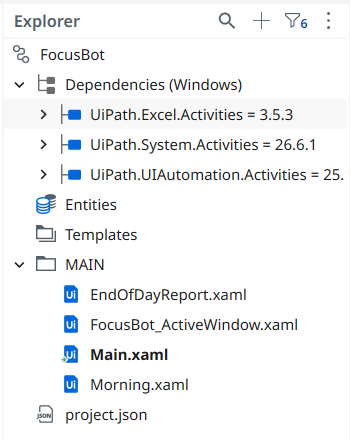
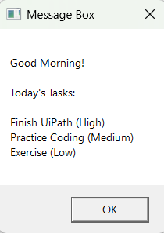
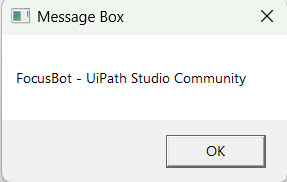
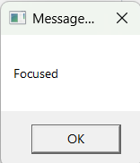
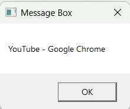
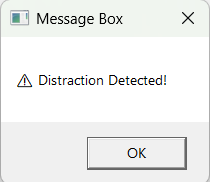
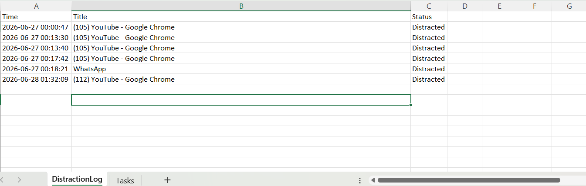
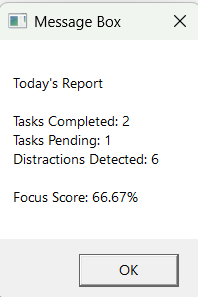

# FocusBot

## Overview

FocusBot is a productivity assistant built using UiPath Robotic Process Automation (RPA). It helps students stay focused during study sessions by displaying daily tasks, monitoring active applications, detecting distractions, logging interruptions, and generating an end-of-day productivity report.

The project demonstrates workflow automation, Excel integration, UI Automation, and modular workflow design using UiPath.

---

## Problem Statement

Students often lose focus by switching to distracting websites and applications during study sessions without realizing how much productive time is lost.

FocusBot helps improve productivity by continuously monitoring the active window, detecting distractions, recording interruption events, and providing a summary at the end of the study session.

---

## Features

* Displays a morning briefing with the day's tasks
* Reads tasks from an Excel workbook
* Continuously monitors the active application window
* Detects distracting websites and applications
* Displays an alert whenever a distraction is detected
* Automatically logs distraction details into Excel with timestamps
* Generates an end-of-day productivity report
* Modular workflow design for easier maintenance and scalability

---

## Technologies Used

* UiPath Studio (Windows Project)
* UiPath System Activities
* UiPath Excel Activities
* UiPath UI Automation Activities
* Microsoft Excel
* Visual Basic Expressions

---

## Project Structure

```text
FocusBot
│
├── Morning.xaml
├── FocusBot_ActiveWindow.xaml
├── EndOfDayReport.xaml
├── Test.xlsx
├── project.json
└── README.md
```

---

## Workflow Description

### Morning.xaml

* Reads the task list from Excel
* Displays a morning briefing before the study session begins

### FocusBot_ActiveWindow.xaml

* Continuously monitors the active application window
* Detects distracting websites and applications
* Displays a warning whenever a distraction is detected
* Logs distraction details into Excel

### EndOfDayReport.xaml

* Reads the distraction log
* Generates a summary of the study session

---

## Screenshots

### Project Structure



---

### Morning Briefing



---

### Active Window Monitoring

Application Monitoring



Monitoring Status



---

### Distraction Detection

Distraction Detection



Logging Status



---

### Excel Distraction Log



---

### End-of-Day Report



---

## How to Run

1. Clone or download this repository.
2. Open the project using UiPath Studio.
3. Install any missing dependencies.
4. Open `Test.xlsx`.
5. Run `Morning.xaml`.
6. Run `FocusBot_ActiveWindow.xaml`.
7. Stop the monitoring workflow after your study session.
8. Run `EndOfDayReport.xaml`.

---

## Excel Workbook

The project uses an Excel workbook to:

* Store daily study tasks
* Maintain distraction logs
* Generate productivity reports

---

## Future Improvements

* Pomodoro timer integration
* Automatic website blocking
* Productivity score calculation
* Weekly analytics dashboard
* Calendar integration
* Custom distraction categories
* Email productivity reports
* AI-based task prioritization
*Export productivity reports as PDF
---

## Learning Outcomes

Through this project, I gained practical experience in:

* Building modular UiPath workflows
* Excel automation
* UI Automation
* Workflow orchestration
* Data logging
* Process automation using RPA
* Designing a real-world productivity automation solution

---

## Author

**Praneetha Vanamala**

GitHub: https://github.com/codedbypraneetha

---

## License

This project is intended for educational and portfolio purposes.
